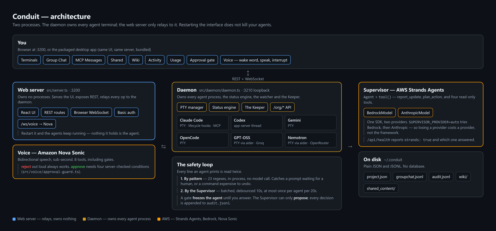

# Conduit

**The human-driven multi-agent control center for professional engineers.**

Conduit is a web dashboard for running and supervising several AI coding agents (Claude Code, Codex, Gemini CLI, OpenCode, GPT-OSS on Groq, Nemotron on OpenRouter) side by side. Every agent runs in a real terminal you can see and type into. An AI Supervisor built on the **AWS Strands Agents SDK** and **Amazon Bedrock** watches their output, tells you what matters, and asks for your approval before anything risky happens.

While autonomous agent platforms hand the steering wheel to the AI, Conduit keeps you in the driver's seat.

## Project provenance (Agents for Humans hackathon)

Built during the submission window for the "Agents for Humans" hackathon (Professional Agents track):

- **Strands Supervisor Agent** (`src/strands/`) — a Bedrock-backed classifier that watches every running agent's output and reports progress, blockers, questions and risky actions.
- **Approval Gates** — fast-path pattern detection (y/N prompts, destructive commands) plus Supervisor classification; the agent's terminal is surfaced in a modal and you decide.
- **Plan-Approve safety valve** — the Supervisor can only *propose* instructions to agents via `plan_action`; nothing is sent until you approve it.
- **Group Chat** — one stream per project with your messages, Supervisor summaries, gates and plan decisions; what you type is delivered into the agents' terminals.
- **Voice pipeline** — speech in, spoken summaries out (browser engines by default, OpenAI/Gemini optional).
- **Usage dashboard** and **AWS deployment** (Docker on EC2, IAM role scoped to Bedrock).

The base scaffolding (PTY runner, React shell, Express server, file storage, project/agent CRUD, shared content, wiki, MCP messaging, Codex orchestrator) pre-dates the hackathon.

## Architecture



```
                       You (browser)
                            │  REST + WebSocket (Basic auth optional)
                   ┌────────▼────────┐
                   │  Web server     │  :3200  React UI · REST · voice proxy
                   │  (Express)      │         relays terminal I/O, never owns processes
                   └────────┬────────┘
                            │  local WebSocket
                   ┌────────▼────────┐
                   │  Daemon         │  :3210 (loopback only)
                   │                 │  owns every agent process, survives web restarts
                   │  ┌────────────┐ │
                   │  │ PTY agents │ │  claude / gemini / opencode in real terminals
                   │  │ Codex      │ │  codex app-server threads (structured view)
                   │  │ Watcher    │─┼──► Strands Supervisor → Amazon Bedrock
                   │  │ The Keeper │ │  Codex-powered orchestrator (Command panel)
                   │  └────────────┘ │
                   └─────────────────┘
```

Two brains, two roles:

| | The Supervisor | The Keeper |
|---|---|---|
| Runs on | AWS Strands Agents SDK + Bedrock | Codex CLI (`codex exec`) |
| Job | Watches agent output, classifies it, raises gates, proposes plans | Answers your questions about the whole org, relays instructions when you ask |
| Can act without you? | **No** — write intent must go through `plan_action` and your approval | Only what you ask it in the Command panel |
| Needs | AWS credentials + Bedrock model access | `codex` CLI logged in |

## Quick start (local)

```bash
git clone https://github.com/devprashant19/Conduit.git
cd Conduit
npm install
npm run build
npm run start:all        # daemon (:3210) + web server (:3200)
```

Open http://localhost:3200. For development with hot reload use `npm run dev` and open http://localhost:5173.

### Native Desktop Application (macOS / Linux / Windows)

Conduit can be packaged and run as a standalone native desktop application bundling the local daemon, PTY terminal grid, and Bedrock supervisor:

```bash
# Run desktop app locally in development
npm run dev:desktop

# Package standalone native binaries (.dmg, .AppImage, .deb, .exe)
npm run build:desktop
```

### Prerequisites

- Node.js 20+
- Build tools for `node-pty` (Windows: Visual Studio Build Tools; macOS: `xcode-select --install`; Linux: `build-essential`)
- At least one agent CLI on your PATH and logged in: `claude`, `codex`, `gemini`, or `opencode`
- For the `gpt` and `nemotron` agent types, [aider](https://aider.chat) plus the matching API key:

  ```bash
  uv tool install --python 3.12 aider-chat   # aider supports Python >=3.10,<3.13
  ```

  then set `GROQ_API_KEY` (gpt → `openai/gpt-oss-120b`) and/or `OPENROUTER_API_KEY`
  (nemotron → `nvidia/nemotron-3.5-lightning:free`) in `.env`. Conduit checks for the
  binary and the key before starting an agent and tells you which one is missing.
- `curl` (used by Claude Code lifecycle hooks; present on Windows 10+, macOS and most Linux)

Optional:

- **AWS credentials with Bedrock access** for the Supervisor. Without them Conduit still works; the Supervisor logs one warning and backs off. Set `CONDUIT_SUPERVISOR=off` to disable it explicitly.
- `codex` CLI for The Keeper (Command panel).
- `OPENAI_API_KEY` / `GEMINI_API_KEY` for cloud speech; the browser engines need nothing.
- `ANTHROPIC_API_KEY` — lets the Supervisor fall back to the Anthropic Messages API when
  Bedrock is unavailable. Without it Conduit reuses the Claude Code OAuth token if present.

Copy `.env.example` to `.env` to configure any of this.

**Where `.env` is read from.** Conduit loads `./.env` (next to the server) *and*
`~/.conduit/.env`, in that order — the first file to define a key wins, and a real
environment variable beats both. The desktop app runs from its install directory and
has no repo, so **`~/.conduit/.env` is where desktop configuration goes**: Bedrock
settings, `GROQ_API_KEY`, `OPENROUTER_API_KEY`, `CONDUIT_AUTH`. `GET /api/health`
reports which files were actually read (`envFiles`) — check it there if a setting
doesn't seem to apply.

Credentials that live outside `.env` work in both modes without any of this:
`~/.aws/credentials` (Bedrock), `~/.claude/.credentials.json` (the Supervisor's
Anthropic fallback), and each agent CLI's own login.

### Verify the install

With `npm run start:all` running in one terminal:

```bash
npm run smoke
```

This creates a throwaway project, exercises every REST route and WebSocket event, starts a real agent (Claude by default; `SMOKE_CLI=gemini` to change, `SMOKE_SKIP_AGENT=1` to skip), triggers and resolves an approval gate, and cleans up after itself.

## How the safety loop works

1. **Watch.** The daemon strips ANSI from each agent's output and runs two checks: a fast regex pass (y/N prompts, `rm -rf`, force pushes, `DROP TABLE`, `kubectl delete`, …) and, every ~10–20 seconds of activity, a Supervisor call on Bedrock.
2. **Gate.** A match sets `pendingGate` on the agent, posts to the project's Group Chat, and opens a modal in every connected browser. Nothing is auto-answered.
   - *Approve* answers a literal y/N prompt with `y`; for anything else it just lets the agent continue.
   - *Reject* answers `n`, or sends Escape and tells the agent to stop.
   - *Type a reply* sends your text to the terminal.
   - Keyboard: `y` / `n` / `Esc`.
3. **Plan.** When the Supervisor wants an agent to *do* something it calls `plan_action`. The plan appears in a modal with the exact message that would be sent. Approve to deliver it, reject with a reason the Supervisor sees on its next turn. Every decision is written to `~/.conduit/projects/<id>/audit.jsonl`.

## Features

- **Multi-vendor** — Claude Code, Codex CLI, Gemini CLI, OpenCode in one UI
- **Projects** — group agents by project; each project gets a shared content folder and a wiki
- **Real terminals** — xterm.js over WebSocket, with scrollback replay for late viewers and automatic reconnect
- **Five layouts** — single, 2-up, 3-up, tmux-style grid, free-form canvas; per-project, persisted
- **Command palette** — `⌘K` / `Ctrl+K`
- **Group Chat** — talk to all running agents at once or `@name` one of them
- **MCP messaging** — Claude agents in the same project can message each other (`message_agent`, `list_teammates`)
- **Project wiki** — persistent, agent-maintained knowledge base (Karpathy's LLM-wiki pattern)
- **Activity feed** — file changes in shared content, agent lifecycle, messages
- **Usage monitor** — Claude and Codex rate-limit windows in the sidebar
- **Voice** — push-to-talk (`⌘;`), optional wake word, spoken Keeper summaries
- **4 themes**, collapsible sidebar, mobile layout

## Configuration

| Variable | Default | Purpose |
|---|---|---|
| `PORT` | `3200` | Web server port |
| `HOST` | `0.0.0.0` | Bind address (`127.0.0.1` to stay local-only) |
| `CONDUIT_AUTH` | *(off)* | `user:password` — HTTP Basic auth for UI, API and WebSocket. **Set this before exposing the port.** |
| `CONDUIT_DAEMON_PORT` | `3210` | Daemon port (loopback only) |
| `AWS_REGION` | `us-east-1` | Bedrock region |
| `BEDROCK_MODEL_ID` | `anthropic.claude-3-5-sonnet-20240620-v1:0` | Supervisor model; must match your IAM policy |
| `CONDUIT_SUPERVISOR` | `on` | `off` disables all Bedrock calls |
| `OPENAI_API_KEY`, `GEMINI_API_KEY` | | Cloud speech providers (can also be entered in Settings) |

## Data on disk

```
~/.conduit/
├── projects/<id>/project.json     # project + agents (+ pending plans, gates)
├── projects/<id>/groupchat.jsonl  # group chat history
├── projects/<id>/audit.jsonl      # gate + plan decisions
├── shared_content/<name>/         # files shared between agents (passed via --add-dir)
├── wiki/<name>/                   # project wiki
├── brain/                         # The Keeper's conversations
├── codex-history/                 # Codex agent transcripts
├── mcp-configs/, hook-configs/    # per-agent Claude Code config (auto-managed)
├── supervisor-log.jsonl           # every Supervisor classification
└── voice.json, api-keys.json      # voice settings / optional API keys
```

Project names are used as folder names under `shared_content/` and `wiki/`; renaming a project moves the folders.

## Agent integration details

| CLI | Runs as | Shared dir / wiki | Status engine | MCP messaging |
|---|---|---|---|---|
| Claude Code | PTY | `--add-dir` | lifecycle hooks (`--settings`) | ✅ session-scoped `--mcp-config` |
| Codex CLI | `codex app-server` thread | writable roots | app-server events | ❌ (use Group Chat / The Keeper) |
| Gemini CLI | PTY | `--include-directories` | process only | ❌ |
| OpenCode | PTY | `AGENTS.md` | process only | ❌ |
| GPT-OSS (Groq) | PTY via `aider` | `--read AGENTS.md` | process only | ❌ |
| Nemotron (OpenRouter) | PTY via `aider` | `--read AGENTS.md` | process only | ❌ |

When an agent starts, Conduit writes a `CLAUDE.md` / `AGENTS.md` section in its working directory describing the shared folder, the wiki, and (for Claude) its teammates.

## Scripts

| Command | Description |
|---|---|
| `npm run dev` | Daemon + web server + Vite with hot reload |
| `npm run build` | Type-check both sides, then build server and client |
| `npm run typecheck` | Type-check only |
| `npm run start:all` | Production: daemon + web server |
| `npm run daemon` / `npm start` | Run either process alone |
| `npm run smoke` | End-to-end smoke test against a running instance |
| `npm run check:agents` | Start one agent of every CLI type and report which run (and why the rest don't) |
| `npm run build:desktop` | Icon + full build + electron-builder → `dist-desktop/` |

## Deployment (Docker / EC2)

The image installs the agent CLIs (including `aider` for the gpt/nemotron types), `curl` and `git`. Agents still need to be logged in: mount your `~/.claude`, `~/.codex`, `~/.gemini` folders (as the compose file does) or run `docker compose exec conduit claude login` once. Put your repositories under the mounted `workspace` folder and use `/workspace/<repo>` as the project directory.

```bash
export CONDUIT_AUTH=admin:choose-a-strong-password   # required by the compose file
docker compose up -d --build
```

On EC2:

1. `t3.small`/`t3.medium`, Amazon Linux 2023 or Ubuntu, Docker + compose plugin installed.
2. Security group: TCP `3200` only from IPs you trust (or put it behind a TLS reverse proxy). Port `3210` stays closed. SSH from your IP only.
3. IAM instance role for the Supervisor — the resource must match `BEDROCK_MODEL_ID`:

```json
{
  "Version": "2012-10-17",
  "Statement": [{
    "Effect": "Allow",
    "Action": ["bedrock:InvokeModel", "bedrock:InvokeModelWithResponseStream"],
    "Resource": "arn:aws:bedrock:us-east-1::foundation-model/anthropic.claude-3-5-sonnet-20240620-v1:0"
  }]
}
```

Check that the model id is still available in your region and adjust `BEDROCK_MODEL_ID` and the policy together.

## Security notes

- Without `CONDUIT_AUTH`, anyone who can reach port 3200 can type into your agents' shells. Keep it on localhost or set a password.
- Shared content and wiki routes are confined to their project folders (path traversal is rejected).
- The Keeper runs Codex with approvals bypassed so it can use its MCP tools headlessly; its only tools are Conduit's org tools, and it is reachable only through the authenticated UI.
- Markdown from agents and models is sanitized before rendering.

## Tech stack

| Layer | Tech |
|---|---|
| Backend | Node.js, Express, TypeScript |
| Frontend | React, Vite, xterm.js |
| AI Supervisor | AWS Strands Agents SDK + Amazon Bedrock |
| PTY | node-pty |
| Transport | WebSocket (terminal I/O, events) + REST |
| Storage | JSON / JSONL files under `~/.conduit/` |
| Build | tsup (server) + Vite (client) |

## License

MIT
